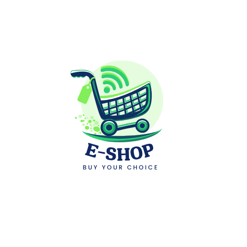

# 🛍️ E-Shop - Modern E-commerce Platform

## Overview
E-Shop is a feature-rich e-commerce platform built with Next.js 14, offering a seamless shopping experience for customers and comprehensive management tools for sellers.



## ✨ Features

### For Customers
- 🛒 Intuitive shopping cart management
- 🔐 Secure user authentication with Clerk
- 📦 Order tracking and history
- 💳 Multiple payment options (Khalti, eSewa)
- 🏷️ Product categories and search
- 📱 Fully responsive design

### For Sellers
- 📊 Comprehensive dashboard
- 📝 Product management (CRUD operations)
- 📈 Order management
- 📦 Stock management
- 💰 Sales tracking

## 🚀 Tech Stack

- **Frontend:** Next.js 14, React, TailwindCSS
- **Backend:** Next.js API Routes
- **Database:** MongoDB with Mongoose
- **Authentication:** Clerk
- **Payment Integration:** Khalti, eSewa
- **Image Storage:** Cloudinary
- **Background Jobs:** Inngest
- **State Management:** React Context

## 🛠️ Installation

1. Clone the repository:
```bash
git clone https://github.com/Mythsoul/Eshop.git
cd Eshop
```

2. Install dependencies:
```bash
npm install
# or
yarn install
```

3. Set up environment variables:
Create a .env file in the root directory with the following:
```env
NEXT_PUBLIC_CLERK_PUBLISHABLE_KEY=your_clerk_publishable_key
CLERK_SECRET_KEY=your_clerk_secret_key
MONGODB_URI=your_mongodb_uri
CLOUDINARY_CLOUD_NAME=your_cloudinary_name
CLOUDINARY_API_KEY=your_cloudinary_api_key
CLOUDINARY_API_SECRET=your_cloudinary_secret
```

4. Run the development server:
```bash
npm run dev
# or
yarn dev
```

## 📁 Project Structure

```
eshop/
├── app/                    # app directory
├── components/            # Reusable React components
├── context/              # React Context providers
├── models/               # Mongoose models
├── public/               # Static assets
└── config/               # Configuration files
```

## 🔑 Key Features Implementation

### Authentication
- Clerk-based authentication
- Role-based access control (Admin, Seller, Customer)

### Product Management
- Create, update, delete products
- Image upload with Cloudinary
- Stock management
- Category organization

### Order System
- Cart management
- Order processing
- Payment integration
- Order tracking

## 🤝 Contributing

Contributions are welcome! Please feel free to submit a Pull Request.

## 📝 License

This project is licensed under the MIT License - see the [LICENSE](LICENSE) file for details.


